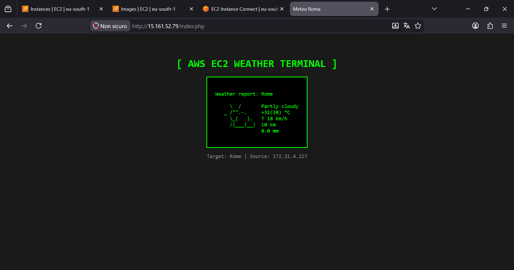

# 🌤️ AWS Weather App - Progetto Cloud Architect

Questo progetto fa parte del mio percorso di studio per la certificazione **AWS Certified Solutions Architect Associate**. Si tratta di un'applicazione web dinamica che mostra le previsioni meteo in tempo reale, interamente ospitata su infrastruttura Cloud AWS.

## 🛠️ Stack Tecnologico
* **Provider:** Amazon Web Services (AWS)
* **Servizio:** EC2 (Elastic Compute Cloud)
* **Server Web:** Apache (httpd)
* **Linguaggio:** PHP
* **Rete:** VPC, Subnet Pubblica, Internet Gateway, Security Groups

## 📐 Architettura
L'applicazione gira su un'istanza EC2 configurata manualmente. Ho implementato un Security Group che permette il traffico HTTP (porta 80) e SSH (porta 22) per la gestione remota. Il codice è distribuito utilizzando Git direttamente sull'istanza.

## 📸 Anteprima

---
*Creato da Paulcloud2527 durante il corso di Stephane Maarek.*
